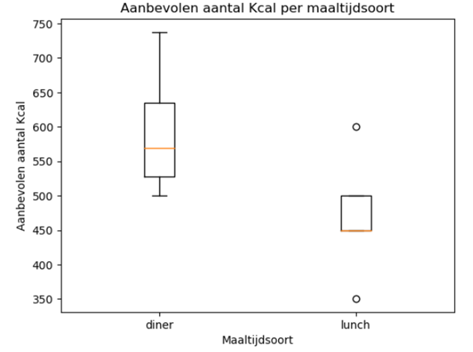
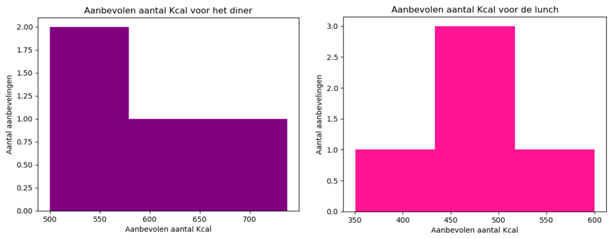
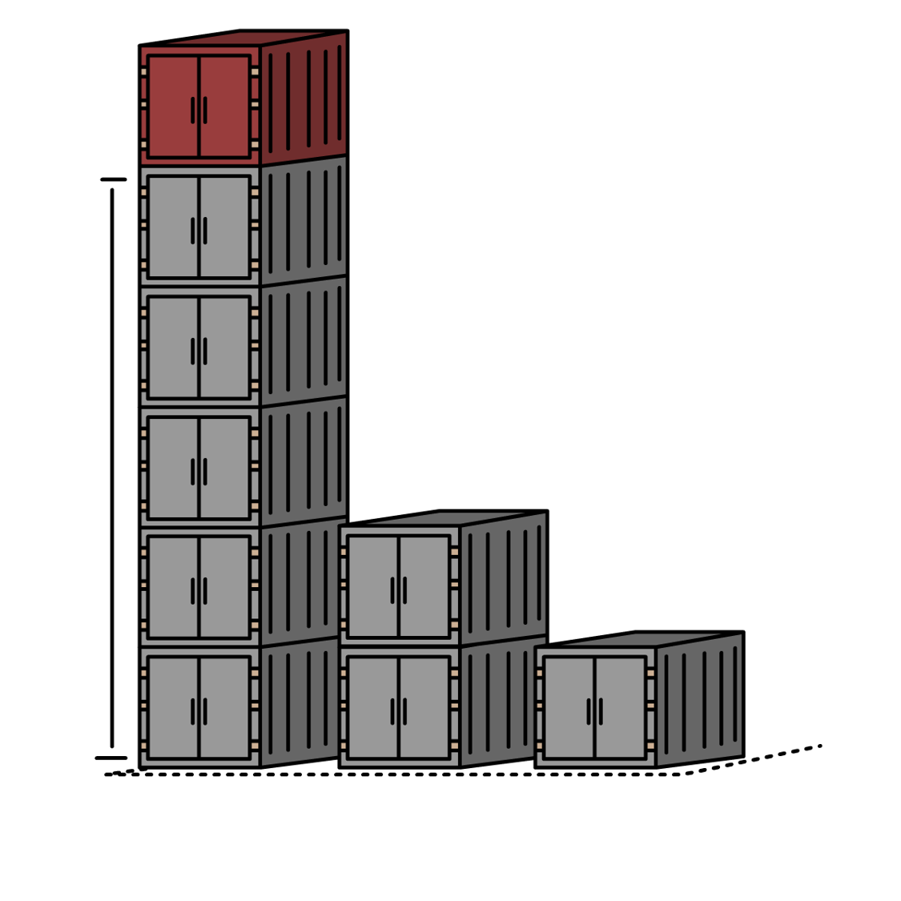
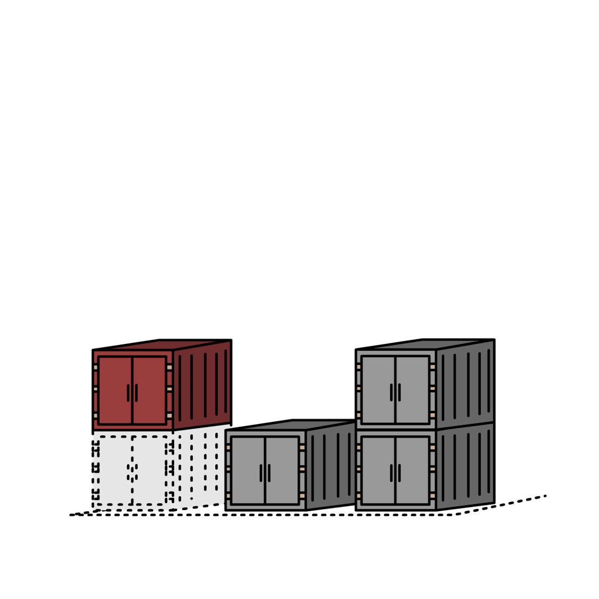
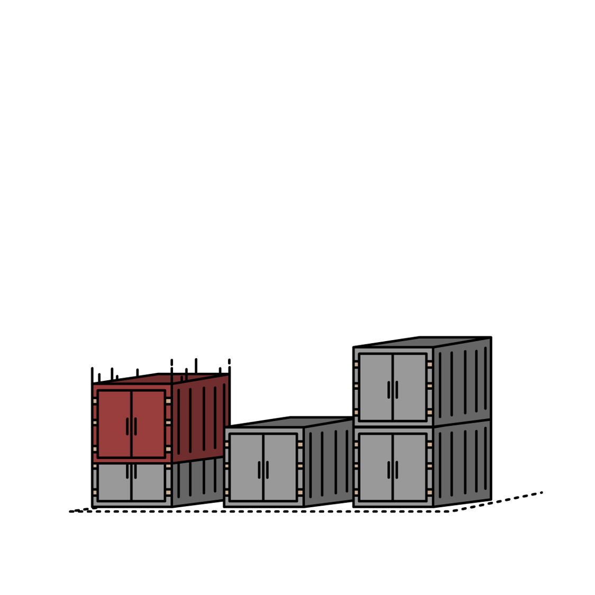

# Portfolio Minor Applied Data Science<!-- omit in toc -->
### Student name: Martti Groenen<!-- omit in toc -->
### Student number: 19174837<!-- omit in toc -->

This is Martti Groenens portfolio for Applied Data Science. This is where I document my skills and achievements that I acquired during this minor.

# <a id="table-of-contents"></a>Table of Contents <!-- omit in toc -->
- [Obligatory Criteria](#obligatory-criteria)
  - [Datacamp assignments](#datacamp-assignments)
  - [Personal Reflection](#personal-reflection)
  - [Personal Learning Objectives](#personal-learning-objectives)
  - [Evaluation of the group project](#evaluation-of-the-group-project)
- [1. The Project](#1-the-project)
  - [Future work](#future-work)
  - [Conculsions](#conculsions)
  - [Planning](#planning)
- [2. Predictive Analysis](#2-predictive-analysis)
  
- [3. Domain Knowledge](#3-domain-knowledge)
  - [Literature](#literature)
  - [Terminology](#terminology)
- [4. Data Preprocessing](#4-data-preprocessing)
  - [Data preparation](#exploring-and-explanation-of-the-dataset)
  - [Data Visualization](#exploring-and-explanation-of-existing-code)
  - [Data collection](#visualization-and-further-exploration-of-the-data)
  - [Evaluation](#evaluation)
  - [Diagnostics](#diagnostics)
- [5. Communication](#5-communication)
  - [Presentations](#presentations)
  - [Paper](#paper)
  - [Feedback](#feedback)

---

# Obligatory Criteria
## Datacamp assignments

- 5 / 12 / 2022 Datacamp progress

  


[Back to Table of Contents](#table-of-contents)
## Personal Reflection
I started this minor with having a fair bit of catching up to do. This was because I actually switched minors twice. My group ended up helping me a lot and they showed me what material I missed. I also studied the slides that I had missed the week prior. 

In the beginning I started off as the "coder" of the group. This meant that I did get off track at times, meaning that I chose style over substance. I noticed that style over substance habit of mine was not efficient at all. After a wake-up call from our teachers, I changed my approach. I made sure that I started off my programs small, and gradually and carefully added functionalities ontop of these programs. Using this approach meant that I could methodically add functionalities without breaking a program.

### **STARR: I put style over substance** 
#### **Situation**
I created a lot of nice looking visualisations of our plot container project. However, the underlaying code ended up being way too slow and buggy.

#### **Task**
Simply put, I needed to find a more effective way to work. This current method made visualising and debugging the code way harder than it had to be.

#### **Action**
I rewrote the entire code from scratch. Creating small and basic functions that I could use in the bigger picture. This meant that I had a stable base to build upon. This way I knew the code was more efficient and less buggy. Furthermore, instead of rendering the results to the screen. I saved them to a file. This way I could visualise them after the fact, thus not impacting the programs performance.

#### **Results**
This method generated a stable base for me to iteratively build on. Whereupon I eventually had a more efficient program.

#### **Reflection**
I think this was a good method of fixing the situation. After having this stable base, I could make things look pretty and neat. I noticed that rigorously testing a small part was a good way to write working code. Another nice feature of this workflow, was if I found an unusual output, something I didn't expect. I could trace it back and find out which part of the code contained the bug.

## Learning Objectives
For this project I set the following learning objectives when I started:
- Develop a strong foundation in programming and data analysis techniques, including proficiency in Python and experience with statistical and machine learning methods. 
- Be able to identify and solve real-world problems using data-driven approaches, including the ability to formulate research questions, collect and clean data, apply appropriate statistical and machine learning techniques, and communicate findings effectively.
- Gain hands-on experience with a variety of data science tools and technologies, including database management systems, data visualization software, and machine learning libraries.

Through the Applied Data Science minor program, I was able to develop a strong foundation in Python programming and data analysis techniques. I had some experience with Python beforehand, but I was able to deepen my understanding and skills through coursework and hands-on projects. I applied the skills I learned in the lectures in a real-world setting through a project using Albert Heijn recipe data and tags to create a recipe recommendation system for people with specific tastes. I gained hands-on experience with various data science tools and technologies, including Pandas, Matplotlib, and Numpy through Datacamp.

### **STARR: Asking for help** 
#### **Situation**
I was not making as much progress as I'd like on Datacamp.

#### **Task**
My task was to finish the current week of datacamp courses.

#### **Action**
I ended up reaching out to my teammates for help with the courses. 

#### **Results**
The result of this action was that my teammates helped me with the parts I struggled with. They thoroughly explained what I did wrong and where I went wrong. Furthermore I ended up finishing the courses with ease while still learning about Data Science.

#### **Reflection**
I think the approach I took was definitely good. I don't think I'd choose a different action the next time I get into this situation. Of course this does assume I've got a group of students following the same course there to help me. If I wouldn't have this, I'd have chosen a different approach.

## Group Reflection/Evaluation
I really enjoyed working with my project group. This has been one of the better groups I've done projects with. However, this does not mean this entire project went without a hitch. In the sections below, I will be evaluating each project member seperately.

### Jesse
Starting with Jesse. From what I've seen from Jesse, he knows how to dive deep into a subject and get into the nitty gritty. This means really getting to know *how* something works before actually starting to realise the product. This is a different approach to mine, but proved effective in combination with mine. 

### Eric
Whenever I'd code with Eric, he'd have a lot of good and calculated insights into what errors I could be making. Furthermore, he also was the main note taker of our project group, this made accessing feedback we got during presentations or meetings way easier and definitely sped up development.

### Joanne
Joanne mainly kept the group together. Her role in this project was mainly being a chairwoman. She'd put us back on topic if we'd drift off topic in a meeting. Furthermore she'd also create really well layed out agendas. I also noticed she made a lot of progress when it comes to her knowledge in applied data science. Especially when we parallelized our work was when she made a lot of progress.

### Sefa
Since Sefa does the same study I do (HBO-ICT) he did have a little bit more coding experience to other teammates. However, complex concepts like reinforcement learning or PCA were a little bit harder to understand for him. Mainly since this is not part of his study. Besides this, I did notice that he made a lot of progress in the latter part of the project. He ended up creating his own working reinforcement learning model.

### Ayrton
Overall as a person, I'd say that Ayrton is a really quiet person. Because of this, it's hard for me to gauge how much progress he made. In a meeting, whenever I'd ask Ayrton about his thoughts on the matter at hand, he'd usually reply "I'm okay with anything". This was not really too useful for us, since we needed actual opinions on the matter at hand. Eventually, we tasked Ayrton to create a reinforcement learning model in about 3 to 4 weeks. He ended up missing that deadline and getting a second chance. After the second deadline passed, he had a working Q-Learning model, however, it did not seem to be able to explain this model at all. This may be because he felt pressured. So in general, I'm not sure how much progress Ayrton made.

### **STARR: Project group work imbalance** 
#### **Situation**
The level of my coding skills was far above my teammates. This resulted in me making a lot of progress, while my teammates couldn't keep up.

#### **Task**
Adopt a method that enables my teammates to make progress without hindering my own ability to progress and without degrading the final product.

#### **Action**
Jesse brought up a good work method, we ended up having everyone make their own version of the program/model. Effectively having everyone work in parallel.

#### **Results**
This meant that we wouldn't get stopped or held back by other teammates, and thus we could take things at our own pace.

#### **Reflection**
This method proved effective since most teammates now know the inns and outs of their own model. Ontop of that, teammates were able to approach other teammates in case they had any questions.

## Contributions

Here are some tasks I contributed on per project:

**FoodBoost**
- [Filtered the dataset to drop recipes with nuts]()
- [Applied a PCA model on our case]()
- [Thought of a way to structure data for the final model]()
- [Created a profile generator based on labels]()
- [Created the first Decision Tree Classifier we trained]()

**Containers**
- [Created a GUI for the project using PyGame]()
- [Created an underlying system for moving containers and checking whether the move is legal]()
- [Created a function that converts list of containers to heightmap]()
- [Created multiple environments]()
- Created multiple agents [DQN](), [CNN (with Jesse)]()
- [Changed our observation/action space (twice)]()
- []()

- [REMOVE THIS](notebooks/Reconstructie%20Paper%20Model.ipynb)
- [REMOVE THIS](#visualization-and-further-exploration-of-the-data)

Here I will reflect on a situation using STARR:

### **STARR: Changing our observation/action space in the container project** 
#### **Situation** 
I noticed it took too long for our Deep Q Network to converge on a stable outcome. Usually the agent would not even find a stable outcome at all. 

#### **Task** 
Find a new way for a Deep Q Network to more easily establish associations by changing our observation and action space.

#### **Action** 
I changed the observation space of the container plot to show a heightmap of the containers. Furthermore I decided to make the actions a 2D matrix, instead of a 3D matrix. This was done since our agent could only put containers ontop of other containers. So there was no real use in having so many unusable actions our agent could take.

#### **Results** 
This change ended up causing our model to train way faster than it did before.

#### **Reflection** 
I think this change was a beneficial one. Since making this change showed me that taking a radically different perspective at a problem you're facing can be really advantageous.


[Back to Table of Contents](#table-of-contents)
# 1. The Project | 100% done
There were two projects we worked on. The first project is Foodboost, and the second project is containers. I will cover both of them seperately here.
## Foodboost
Project foodboost was aimed at creating a recommendation system for users with a nut allergy. This project benefits me personally, since there's often a limited choice for me when it comes to food.

For project foodboost, we set the following research questions:
1. What ingredients can be considered as a nut?
2. What is an average amount of calories for lunch and dinner combined?
3. What method is used/can be used for predicting if someone likes a specific recipe?
4. What method can be used to make a diet schedule with as much variety as possible?

### Future work
In the future, this project could be expanded upon by creating modifiable filters. So not only people with nut allergies can use this program, but also people with gluten allergies or a lactose intolerance.

### Conclusions

#### 1. What ingredients can be considered as a nut?

We did some research on what ingredients can be considered a nut. Through this research, we compiled a list of ingredients that we should avoid. This list can be applied to filter out the recipes that contain nuts. Furthermore, we found out that filtering out nuts is not as easy as filtering any recipe that includes an ingredient with the word ``noot``. Since ``nootmuskaat`` is not a nut, we had to also create a list with false positive ingredients.

#### 2. What is an average amount of calories for lunch and dinner combined?

Our research concluded that the average amount of calories of lunch and dinner combined lands around 1040 Kcal. As shown in the boxplot below, the average dinner is around 575 Kcal, and the average lunch is around 465 Kcal. 
<details><summary>Boxplot</summary></details>

The barplot below shows the distribution of Kcal for lunch and dinner.
<details><summary>Barplot</summary></details>


#### 3. What method is used/can be used for predicting if someone likes a specific recipe?

For our project, we trained a Decision Tree Algorithm on a dataset that contains recipe ingredients the user likes, and recipe ingredients the user dislikes. Using this data, the Decision Tree Algorithm then predicts whether the user likes or dislikes unseen recipes.

#### 4. What method can be used to make a diet schedule with as much variety as possible?

To create a diet schedule with as much variety as possible, we used a Linear Programming model. This model used restrictions to not serve the user the same recipe every day, and a restriction that makes sure that the combined Kcal of dinner and lunch is below 1040. The model was only allowed to choose one lunch and one dinner recipe per day.

### Planning
In the beginning, our plan was to use trello as a place where we could update each other on the advancements we made on our project. Eventually, we ended up forgetting about trello entirely, since we had to focus on getting things done rather than planning.
<details><summary>Planning Foodboost</summary></details>

## Containers
This case covers the sorting problem when it comes to unloading and loading containers between ship and shore. 

For project containers, we set the following research questions:

1. What methods are viable to solve the container stacking problem?
2. What is a move, and what are the restrictions?
3. What type of containers do we have to use?
4. How is the port layed out?
5. How can we simulate container data?

### Future work
Future work could build upon our model. For instance, the environment could be modified so the agent could select between several ship containers. This would make it so the agent could more efficiently create layouts. Besides this, we also only focused on offloading the containers. We didn't focus on container management on shore, or when loading containers onto ships.

### Conclusions
#### 1. What methods are viable to solve the container stacking problem?

The method we used to solve the container stacking problem is using a Reinforcement Learning algorithm called DQN. This algorithm remembers the rewards of the previous moves and optimizes this reward.

#### 2. What is a move, and what are the restrictions?

A move in our environment is placing a container in a legal spot in a container lot. The restrictions are as follows: there may not be a container north and south of the container our agent is trying to place. Furthermore there may not be a container in the spot the agent is trying to place a container. Lastly the container may not be floating.
<details><summary>Restriction Images</summary>
Container may not exceed max height<br>
<br>
Container may not be floating<br>
<br>
Container may not be inside another container<br>
<br></details>

#### 3. What type of containers do we have to use?

For this project, we used the standard 20ft container. This ended up not being too useful for our final product, but we did specifically chose this container since it's the standard for pretty much all shipping containers. 

#### 4. How is the port layed out?

We did find out the layout of the port, however, we ended up not using this layout and focusing on a smaller container plot first. 

#### 5. How can we simulate container data?

Our model uses priority tags for every container. The priority tag pertains to what order the containers have to leave the plot again. The way we simulate container data, is by applying random integer priorities within a specific range to every container on the incoming ship. 

### Planning
For this project we also decided on using Trello again. Eventually though, we forgot about it again. Nevertheless, we all knew what was going on and what the tasks were that we had to complete.
<details><summary>Planning Containers</summary></details>


[Back to Table of Contents](#table-of-contents)
# 2. Predictive Models | 90% done

I have made the following predictive models. I will seperate them per project.
## Project Foodboost
Project foodboost was mainly based around basic machine learning models. During this project I also experimented with Principal Component Analysis (PCA). These predictive models were eventually supposed to recommend recipes to users. 

### PCA 
The workflow of my PCA was simple. 
- Firstly, I created a "review" dataset, which included a lot of users. This dataset was generated through matrix multiplications. Due to these matrix multiplications, this dataset ended up having a specific structure. 
- Afterwards, I randomly replaced 60% of the "review" dataset with ``NaN``. 
- Then I replaced the ```NaN```'s with zero's and applied Singular Value Decomposition. Effectively, what this does is it splits the matrix into two seperate matrices.
- Subsequently, I reconstructed the predicted "review" dataset out of the two matrices I created in the prior step. Do note, however, that these values are not close to the ground truth.
- Then I overlayed the known review values (the other 40% of the dataset that was not dropped) over the predicted dataset.
- Upon this mixed dataset I then applied Singular Value Decomposition again. This time, after reconstructing the newly predicted dataset using the two generated matrices, the prediction got a little bit closer to the ground truth.

By iteratively applying those steps (``SVD``, ``Matrix Multiplication``, and ``Overlay original numbers``) we're able to approach the ground truth. Hereby creating an accurate recommendation for a singular user using a huge dataset of reviews from other users. This approach deemed too intricate  for first project. Thus we eventually used a different approach.

This approach was based on a 2022 [paper written by Trevor Hastie, Michael Greenacre, and Patrick Groenen](https://www.nature.com/articles/s43586-022-00184-w)

### Decision Tree Classifier.

In the new version of this case, we used the Albert Heijn dataset to extract recipe information. This recipe information included ingredients and tags. Using this data, I created a predictive model that was able to train for recommendations for a singular user. To generate the data, I first had to define what tags the user liked, and what tags the user disliked. Using these tags, I was able to randomly pick recipes from those tags. I would extract the ingredients from these recipes, this would be the ``X`` dataset that our predictive model would train on. As for our ``y`` dataset, I set this to 0 for "disliking" a recipe and 1 for "liking" a recipe respectively. Therefore, I generated a dataset with a specific structure in it for our predictive model to train on. My project group decided on having everyone try a different classifier model on the generated dataset. I ended up using ``Decision Tree Classifier`` (as recommended by my group). Using a confusion matrix  to compare this with other models, we were able to deduct that a ``Decision Tree Classifier`` yielded the best results.

## Project Containers

Project containers used a completely different approach to a predictive model. Since this project heavily relied on reinforcement learning, I created my own [``Agent``](), [``Environment``](), and [``Neural Network``]() in pytorch. This environment ended up going through several different iterations. 

### First iteration
The first iteration was heavily based on having a good looking interface. This however, ended up being the thing that slowed the environment down way too much. Besides that, the environment was not created with a 3D matrix in mind, but rather a ``pandas`` dataframe with every entry being a container. This ended up taking up way too much time, and we ended up scrapping this too.

### Second iteration

The second iteration seemed to yield better results. I created a function that would convert a 3D matrix into a 2D heightmap. This heightmap would be interpreted by a basic ``Deep Q Network`` (DQN). I was able to train this model in such a way that it wouldn't attempt to put containers in illegal positions.

### Third iteration

Together with Jesse we created a third iteration. This iteration used roughly the same environment as the second iteration, however, we used a ``Convolutional Neural Network`` (CNN) to interpret the 2D heightmap. Using this approach ended up not working too well. We ended up scrapping this, due to a suggestion I will touch on in the next paragraph.

### Fourth iteration

The Fourth iteration seemed to perform way better than all previous iterations. We got a suggestion from ``Jeroen Vuurens`` that, instead of using a 2D heightmap, or a 3D matrix. We should use something that seperates the rows (X-axis) from the columns (Y-axis) and stacks (Z-axis). Using that clue, I created an environment that would allow the agent to choose between rows. Instead of choosing exactly where to put the container, I only let our agent choose which row to put it in, and the rest was handled by my environment. This approach ended up working really well. The training graph of this final approach is shown in the graph below.

  

There are two features to this graph that need some explaining. First off the theoretical maximum is based on the absolute maximum score that our environment can put out. Our model will never be able to score beyond that value. Secondly, these 79200 games took around one and a half hours to complete. This may seem long, however, this does not impact the eventual prediction speed.

[Back to Table of Contents](#table-of-contents)
# 3. Domain Knowledge | 0% done
\<Insert Domain knowledge>

[Back to Table of Contents](#table-of-contents)
# 4. Data Preprocessing | 80% done
Here I will cover the data preprocessing for the two projects I've worked on.
## Project Foodboost
For project Foodboost, we were given a lot of recipe data. In our case, not all of this data was useful. Eventually we ended up only using the `ingredients.csv` and `tags.csv` dataset.

### Filtering nuts
To filter out the nuts, I created a simple function to determine whether an ingredient contains nuts or not. 
```py
def filterFunc(inputString):
    notenLijst = ["noot","pinda","eikel","amandel","cashew","hazelno","hican","hickory","kemirie","macadamia","nangaino","parano","pecan","pistache","kastanje","walnoot","betelno","beukenno"]
    falsePositives = ["muskaat"]
    for i in falsePositives:
        if i in inputString:
            return False
    for o in notenLijst:
        if o in inputString:
            return True
    return False
```
This code returns True if the string contains a word commonly associated with nuts and False if it doesn't.
<details><summary>Thorough code explanation</summary>This function first checks whether the inputString contains a false positive. If it does, it returns False. If it doesn't contain a false postive, it checks whether the inputString contains the one of the ingredients that contain nuts. If it does contain nuts, it returns a True, else it returns False. </details><br>


The `ingredients.csv` dataset was laid out like this:
| nr | recipe                        | ingredient       | quantity | unit |
|----|-------------------------------|------------------|----------|------|
| 0  | Kruidnoten met choco-discodip | melkchocolade    | 100.0    | g    |
| 1  | Kruidnoten met choco-discodip | kruidnoten       | 100.0    | g    |
| 2  | Kruidnoten in marsepein       | blanke marsepein | 150.0    | g    |

I iterated over every row of this ``ingredients.csv`` dataset. This code uses the function ``filterFunc()`` I created.
```py
#Import dataset to df
df = pd.read_csv('Datasets Foodboost/ingredients.csv')

#Create empty dictionary
notenDict = {}

#Create empty lists
safeList = []
unsafeList = []

#Iterate over every row in the dataset
for i in df.itertuples():
    #If the recipe is not in the ductionary, add it.
    if not i[2] in notenDict.keys():
        notenDict[i[2]] = False
    
    #If the current row has an ingredient that contains nuts, set the ingredient in the dictionary to True
    if filterFunc(i[3]):
        notenDict[i[2]] = True

#Convert Dictionary to DataFrame
outputDF = pd.DataFrame.from_dict(notenDict,orient='index')
print(outputDF.head())
```
This code effectively marks every recipe that contains nuts. Do bare in mind however, that this is a prototype. In reality, there could be way more types of nuts that we haven't added to the "ban list".
<details><summary>Thorough code explanation</summary>Our code iteratively checks every row of ingredients.csv. If the dictionary we created does not contain an entry for the current recipe, it gets added with a value of False. Afterwards, it checks whether the current ingredient being checked contains nuts using the filterFunc() function I showed before. This creates a dictionary with a True for every recipe that contains nuts, and a False for every recipe that doesn't contain nuts.</details><br>


Finally, we can drop every row that has a recipe that contains nuts.

To further clean the data and get more accurate results, we also removed all ingredients that had less than 40 entries. 

### Preparing and explaining the data
With the filtered dataset generated, we can now focus on preparing the data so we can feed it through to the Machine Learning algorithm. A Machine Learning algorithm takes two datasets, an ``X`` and a ``y`` dataset. The ``X`` dataset contains features, and a ``y`` dataset contains the value we want to predict. From this point forward, I'll call the dataset we want to feed to the Machine Learning algorithm ``preference dataset``. The ``X`` of our ``preference dataset`` should contain the ingredients of a recipe, and the ``y`` of our ``preference dataset`` should be a boolean value indicating whether the user likes the recipe or not.

To generate an artificial list of recipes the user would like and dislike, I chose certain tags from the ``tags.csv`` dataset. For instance, our user likes the tag "italiaans" and dislikes the tag "frans". In this case, we'd add 20 randomly chosen recipes with the "italiaans" tag with a ``y`` of True to the ``preference dataset``. Afterwards, we'll do the same for the "frans" recipes, instead changing the ``y`` to False for these entries. 

After this, we split the ``preference dataset`` into a train, test and validation dataset. This is done so we can evaluate our model.


## Project Containers
Data preprocessing is a little bit different when it comes to reinforcement learning. The way our RL-agent learns is through observing the effect of its actions on a specific environment. This means I have to first collect data to train on.

### Data collection
Our reinforcement learning algorithm has a parameter ``epsilon``. This parameter is used to choose whether a random action is chosen or whether the neural network chooses the action. At the beginning of the training process, the epsilon is fairly high (near 1). An epsilon near 1 means that pretty much all the moves the agent chooses are random. When this parameter is decreased, the neural network will take more and more "calculated" actions.

The second important thing our RL-agent does is it remembers its previous moves, outcomes and rewards. This collection of data is called our memory, thus effectively being our ``X`` and ``y`` dataset. 

To visualise the outcome of our game, I created a render of these containers.
<video src="images/FullSolution0001-0080.mp4" controls="controls" style="max-width: 730px;"></video>

[Back to Table of Contents](#table-of-contents)
# 5. Communication

## Presentations

During this minor I have presented about 3 to 4 presentations. TODO: What were they abt and a link to the presentations 

## Paper
For our paper I wrote ``insert part here``: link to paper

